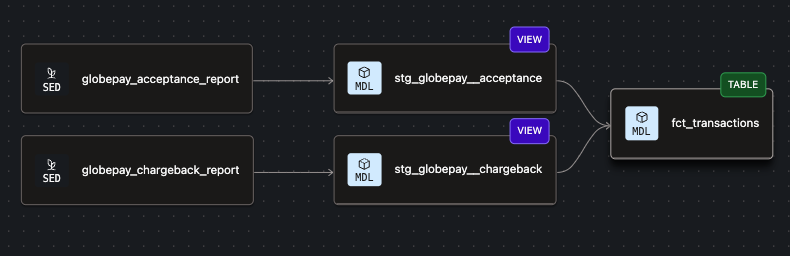
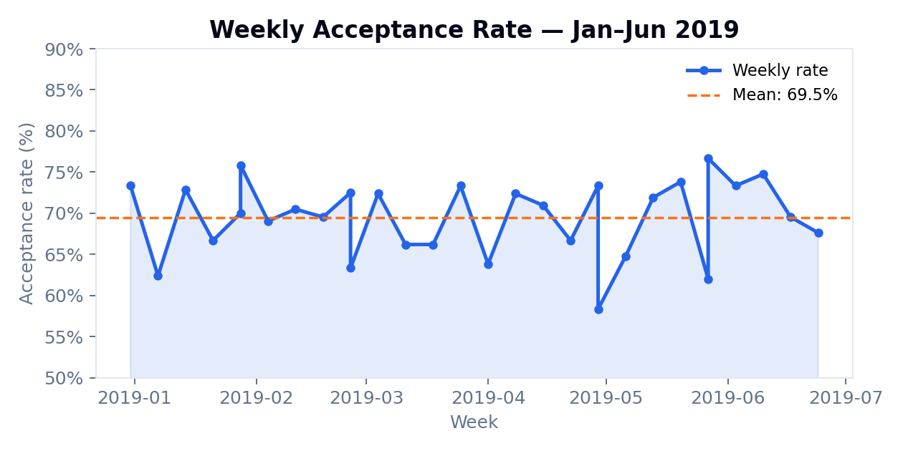
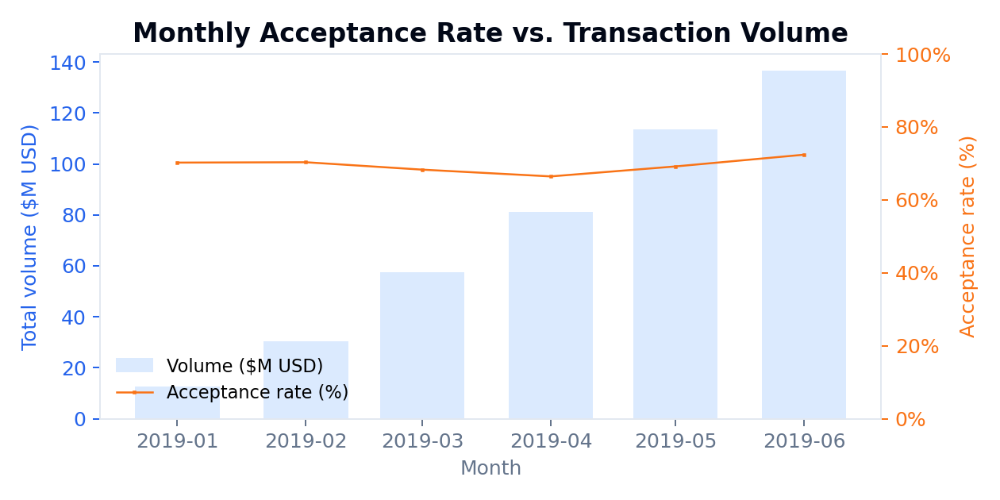
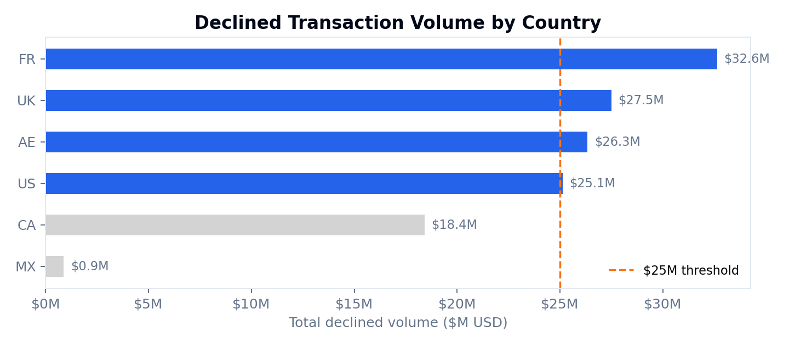

# Deel Analytics Engineer — Take-Home Challenge

Analysis of 5,430 Globepay payment transactions (Jan–Jun 2019) using dbt + DuckDB.

---

## 1. Preliminary Data Exploration

| Dataset | Rows | Key fields |
|---|---|---|
| `globepay_acceptance_report` | 5,430 | `external_ref`, `state` (ACCEPTED/DECLINED), `amount`, `currency`, `rates` (JSON), `cvv_provided` |
| `globepay_chargeback_report` | 5,430 | `external_ref`, `chargeback` (TRUE/FALSE string) |

- `amount` is in **major units** (dollars), not cents despite the API spec.
- `rates` is a JSON string mapping ISO currency codes to units-per-1-USD, embedded per row.
- Both datasets join 1:1 on `external_ref` with 100% coverage.

---

## 2. Model Architecture

Medallion architecture: raw seeds → typed staging views → one wide mart table.

| Layer | Materialisation | Schema | Purpose |
|---|---|---|---|
| Seeds | table | `main_raw` | Raw CSVs loaded as-is |
| Staging | view | `main_staging` | Type casting, boolean conversion, FX normalisation |
| Mart | table | `main_marts` | `fct_transactions` — single analyst-ready model |

**`fct_transactions`** : one row per transaction, all dimensions included:

| Column | Type | Description |
|---|---|---|
| `external_ref` | varchar | Primary key |
| `transaction_at` / `_date` / `_week` / `_month` | timestamp | Time grain hierarchy |
| `source`, `country`, `currency` | varchar | Dimensions |
| `amount_usd` | numeric | FX-converted amount |
| `is_accepted` | boolean | ACCEPTED = true |
| `is_cvv_provided` | boolean | CVV flag |
| `is_active` | boolean | Globepay active flag |
| `has_chargeback` | boolean | Chargeback filed |
| `is_missing_chargeback` | boolean | No matching chargeback record |

---

## 3. Lineage



---

## 4. Tips

**Macros:** `convert_to_usd(amount_col, rates_col, currency_col)` centralises FX conversion with database-specific branches (`duckdb` / `postgres`) for JSON parsing. Adding a new adapter requires only a new `` block.

**Data validation:** Tests at every layer. Seeds enforce column types to prevent silent coercions, staging catches nulls and duplicates on primary keys, and the mart's `is_missing_chargeback` flag acts as a live completeness monitor without a separate model.

**Documentation:** Every model, seed, and column has a `description` in `schema.yml`. Run `dbt docs generate && dbt docs serve` to browse the full data catalog.

---

## Deel Home Task

Production model: `main_marts.fct_transactions`. All questions below are answered by querying this single table.

### Q1 — What is the acceptance rate over time?

**The acceptance rate is stable at 68–72% across all 26 weeks (Jan–Jun 2019),** with a mean of ~70%. No alarming trend or sudden drop. Volume grows modestly month-over-month.




```sql
SELECT
    transaction_week,
    COUNT(*)                                                AS total_transactions,
    SUM(is_accepted::INT)                                   AS accepted_transactions,
    ROUND(SUM(is_accepted::INT)::NUMERIC / COUNT(*) * 100, 2) AS acceptance_rate_pct
FROM main_marts.fct_transactions
GROUP BY transaction_week
ORDER BY transaction_week
```

---

### Q2 — Which countries had declined transactions exceeding $25M?

**Four countries exceed the $25M threshold: FR ($32.6M), UK ($27.5M), AE ($26.3M), US ($25.1M).**



```sql
SELECT
    country,
    SUM(amount_usd) AS total_declined_usd
FROM main_marts.fct_transactions
WHERE NOT is_accepted
GROUP BY country
HAVING SUM(amount_usd) > 25000000
ORDER BY total_declined_usd DESC
```

---

### Q3 — Which transactions are missing chargeback data?

**The result is 0 rows — 100% chargeback coverage.** The `is_missing_chargeback` flag in `fct_transactions` will surface any future gaps automatically as new data arrives.

```sql
SELECT external_ref, transaction_at, country, amount_usd
FROM main_marts.fct_transactions
WHERE is_missing_chargeback
```

---

## Quick Start

```bash
pip install -r requirements.txt
cd deel_dbt
dbt deps
dbt build
```

To use Supabase instead of DuckDB, copy `.env.example` → `.env`, fill in credentials, then run `dbt build --target supabase`.
